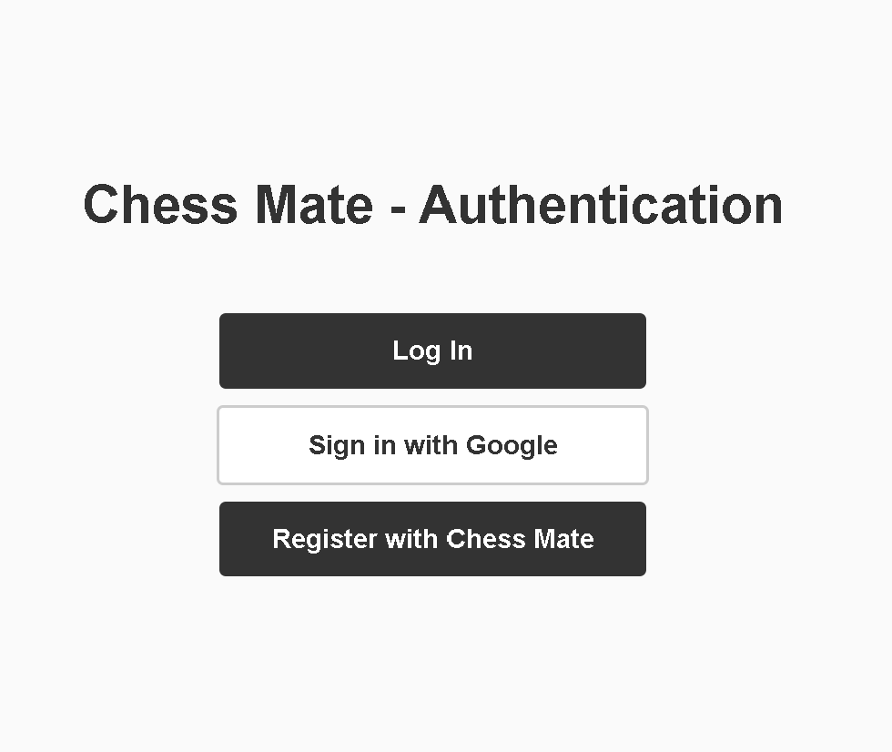
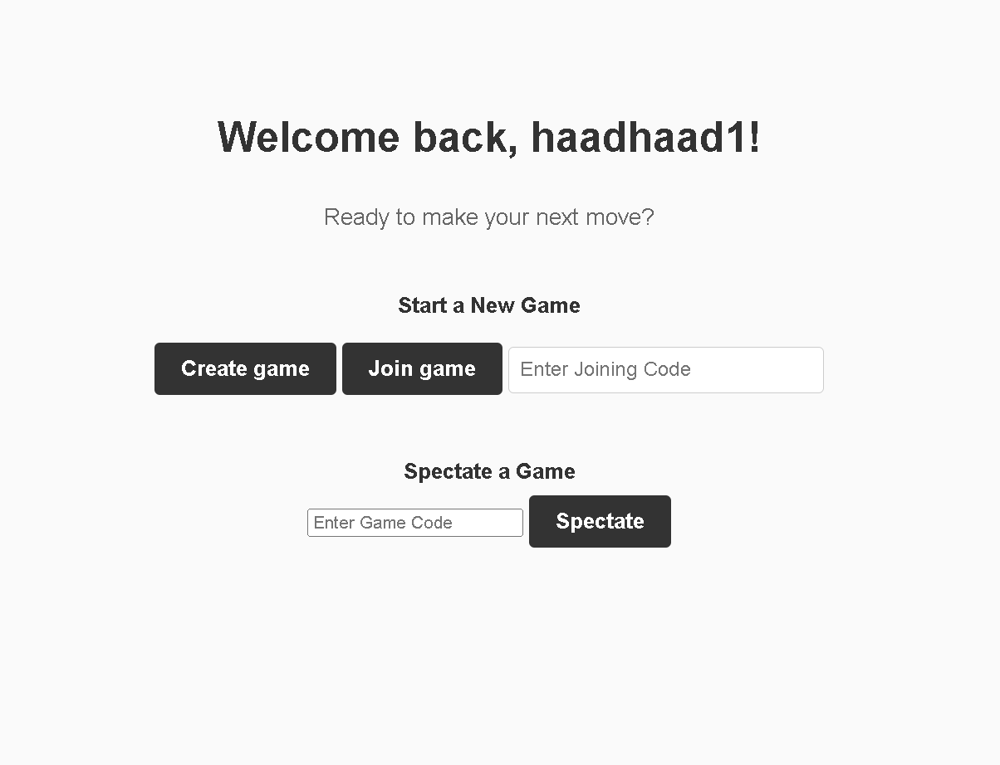
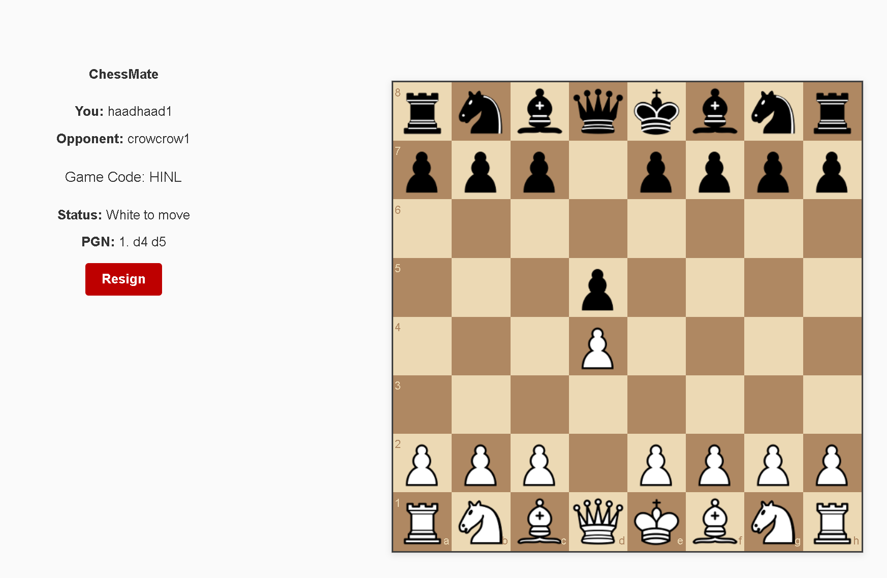
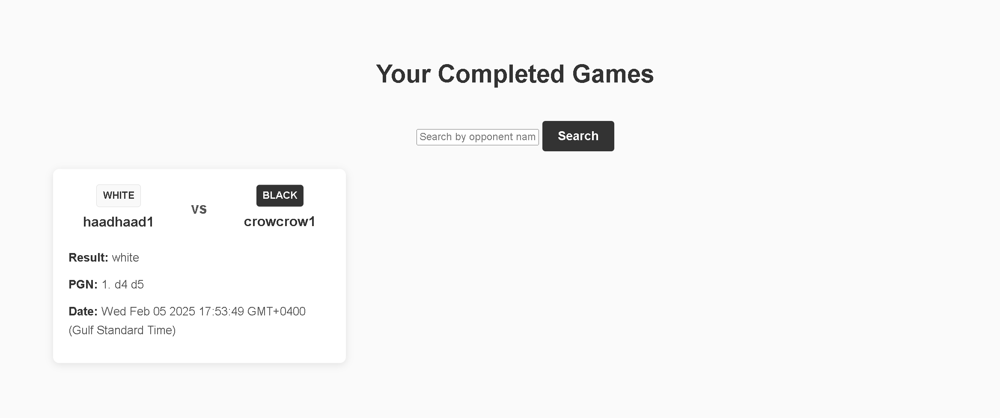

# ChessMate

ChessMate is a real-time chess web application that lets users create, join, and spectate games online. Built using Node.js, Express, Socket.IO, and MongoDB, it offers a seamless, interactive experience with live move updates, user authentication, and game history tracking.

## Features

- **Create & Join Games:** Quickly generate unique game codes and join existing games as white, black, or spectator.
- **Real-Time Gameplay:** Leverages Socket.IO for live move updates and game state synchronization.
- **Spectator Mode:** Watch games in progress with real-time updates.
- **User Authentication:** Secure login and registration via Passport.js and Google OAuth.
- **Game History:** View completed games and results.
- **Session Management:** Uses express-session with MongoDB to manage user sessions.


## Technologies Used

- **Backend:** Node.js, Express.js
- **Real-Time Communication:** Socket.IO
- **Database:** MongoDB (with Mongoose)
- **Templating Engine:** Express Handlebars
- **Authentication:** Passport.js, Google OAuth 2.0
- **Session Store:** connect-mongo

## Installation

### Prerequisites

- [Node.js](https://nodejs.org/en/download/) (v14 or later recommended)
- [npm](https://www.npmjs.com/get-npm) (comes with Node.js)
- A running instance of [MongoDB](https://www.mongodb.com/) or a MongoDB Atlas account
- A Google CLient ID for OAuth2.0

### Setup

1. **Clone the Repository:**

   ```bash
   git clone https://github.com/zii-bee/ChessMate.git
   cd ChessMate
   ```
2. ** Install Dependencies:**
   ```bash
   npm install
   ```
3. **Configure Environment Variables:**
   Create a .env file in the root directory and add the following variables (replace placeholder values with yours):
   ```env
   DSN=your_mongodb_connection_string
   SESSION_SECRET=your_session_secret
   PORT=3000
   GOOGLE_CLIENT_ID=your_google_client_id
   GOOGLE_CLIENT_SECRET=your_google_client_secret
   APPURL=http://localhost:3000
   ```
4. **Start the Application:**
   In the root directory, where you see app.js as a file:
   ```bash
   node app.js
   ```
   Your application will run at HTTP://localhost:3000, or as you specify the port

## Usage

### Authentication
Log in and retain your session and game history with your account. 
  
*The auth page showing login, register, and Google sign-in.*

### Creating a Game
Log in and navigate to the game creation page. A unique game code is generated, and your game is set to "waiting" until an opponent joins.

### Joining a Game
Enter the provided game code to join as a player (white or black) or spectate if you only wish to watch.
 
*The home page after login where you can create, join, or spectate games.*

### Gameplay
Enjoy real-time chess gameplay. Moves, game state, and spectator counts are synchronized using Socket.IO.

  
*In-game screen between two players.*

### Game History
After completing games, you can track your gameplay history, view past results, and analyze your performance.

  
*Page showing your game history as a player.*

## Contributing

Contributions are welcome! If you have suggestions, bug fixes, or new features, please follow these steps:

1. **Fork the repository.**
2. **Create a new branch:**

   ```bash
   git checkout -b feature/your-feature
   ```
3. **Commit your changes:**
   ```bash
   git commit -am 'Add new feature'
   ```
4. **Push to your branch**
   ```bash
   git push origin feature/your-feature
   ```

